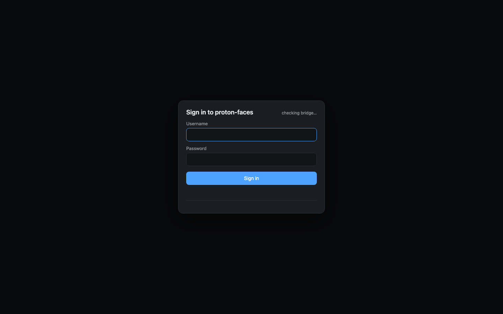

# Quickstart

This guide walks you from a fresh `docker compose up` to your first search and your first named person, using real screenshots captured from the built-in demo instance.

## What you'll do

1. Start the demo with one command.
2. Sign in.
3. Search for *dog*.
4. Open the **People** tab and name a face.
5. Watch look-alikes auto-tag.
6. Open the **Places** map.

Each step has a screenshot so you can compare against your own instance.

## 0. Start the demo

```bash
docker compose --profile demo up -d
```

That's it. After ~60 seconds, open **http://localhost:8080**.

!!! info "What just happened?"
    Two containers came up (`indexer-demo`, `app-demo`) with `DEMO_MODE=1`. They skipped the real Proton bridge and instead loaded `app/src/demo_assets/` — a curated fixture of 82 CC0 photos from Picsum and randomuser.me. The indexer processed all of them in well under a minute.

The default credentials are `demo` / `proton-faces`. Override the password with `DEMO_ADMIN_PASSWORD=...` in `.env` if you're sharing the host.



## 1. Sign in

Type the username and password, click **Sign in**. The page reloads, and the main app appears.

## 2. The photos grid

You land on the **Photos** tab — an infinite scroll of all 82 demo photos, with the **"On this day"** strip hidden because nothing matches today (the dates are randomized 2024 dates).

{ loading=lazy }

Notice the small badges:

- The **place label** (e.g. *Paris, France*) is shown for any photo with a GPS-tagged city.
- The **"faces" pill** (blue) marks photos where the face detector found one or more faces.
- The **★ favorite button** in the top-right of each card.

## 3. Search for *dog*

Click the search bar at the top-right (placeholder: *Search: "dog", "car", "Lille", "beach"...*). Type `dog` and press **Search** (or hit <kbd>Enter</kbd>).

{ loading=lazy }

The grid re-ranks immediately. The query is matched by **zero-shot CLIP**: the text *dog* is embedded into the same 512-d vector space as every photo, then ranked by cosine similarity. You can type anything — *beach*, *car*, *Lille*, *sunset*, *cat* — and it works the same way. There's no per-photo tagging and no training step.

Type `Lille` next to see how it handles place names via GPS reverse-geocoding.

## 4. Open the People tab

Click **People** in the top navigation. You'll see a grid of unknown-person cards with face-crop covers.

{ loading=lazy }

Each card represents a **person cluster** — a group of faces that HDBSCAN grouped together by ArcFace embedding similarity. The cluster was built automatically and incrementally, and it runs again every `CLUSTER_INTERVAL` seconds (30 min by default).

To rename a cluster, type a name in the **Name** field on the card and press <kbd>Enter</kbd>. The card immediately updates with the new name and the cluster's representative face-crop.

## 5. Click into a person

Click any of the person cards to see the photos that contain their face.

{ loading=lazy }

Click **Map** on the card to see every place that person has been photographed in (a Leaflet map filtered to that person's photos).

## 6. Open a photo and use face tagging

Click any photo to open the detail view. Hover over a face — a blue outline appears.

The face boxes are clickable. Click one, type a name in the popover (or pick an existing person from the dropdown), and the face is named. Crucially, **every unassigned face that looks like the same person is auto-tagged** — that's the "propagation" that makes tagging 100 photos take a minute instead of an afternoon.

## 7. Open the Places map

Click **Places** in the top navigation. The Leaflet world map loads with one clustered marker per city you've photographed.

{ loading=lazy }

Click any marker or any of the city chips below the map to filter the photos grid to that place.

## 8. Browse the rest

Other tabs you might want to poke at:

- **Albums** — Proton albums (read-only).
- **Tags** — your free-form lowercase labels (set them on a photo's detail panel).
- **Duplicates** — content-hash matches; hide any you don't want.
- **Unassigned** — every face that didn't cluster into a person; the queue to clean up.
- **Favorites / Archive** — your starred and hidden photos.

## What's next?

- Read the [full User guide](../user-guide/index.md) for every feature, every shortcut, and the admin area.
- When you're ready to point at your real Proton Drive, follow the [Installation guide](installation.md) and the [Session file guide](session-export.md).
- If anything looks weird, the [Troubleshooting](../reference/troubleshooting.md) page covers the usual gotchas.
