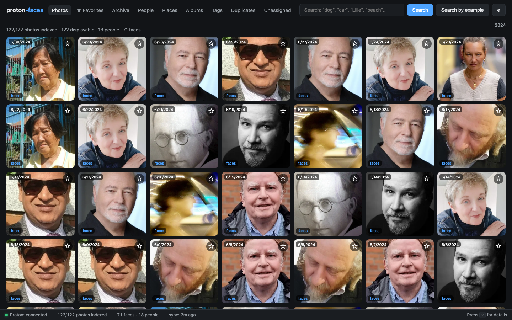
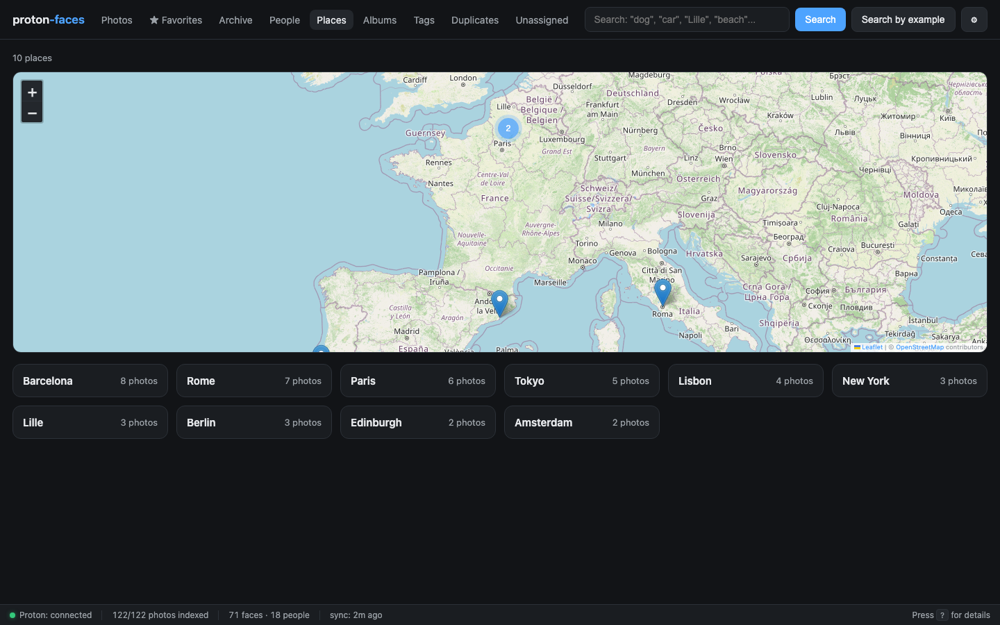
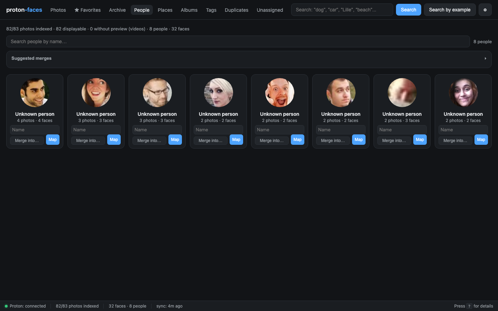
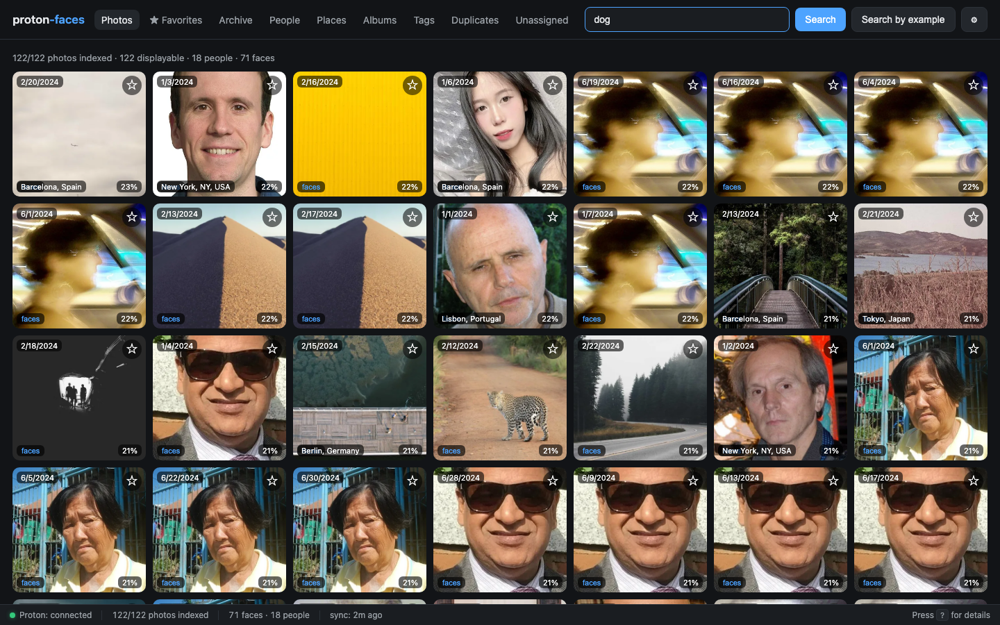
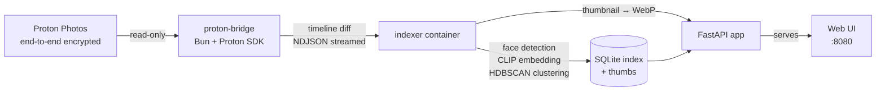

---
hide:
  - navigation
  - toc
---

# Private, self-hosted face · object · location search for your Proton Photos

  <h1>Search your photo library like Google Photos — but private.</h1>
  
Proton Faces indexes your end-to-end encrypted Proton Photos locally so you can search faces, places, and objects without ever uploading a single byte back.

  

    <a class="pf-cta-primary" href="getting-started/quickstart/">Get started in 5 minutes →</a>
    <a class="pf-cta-secondary" href="getting-started/demo-mode/">Try the demo (no account)</a>
    <a class="pf-cta-secondary" href="https://github.com/mmornati/proton-faces">View on GitHub</a>
  

{ loading=lazy }
{ loading=lazy }
{ loading=lazy }
{ loading=lazy }

## What it does

Proton Photos are **end-to-end encrypted** — so nobody but you (and your own machine) can ever look at them. That also means *you* have to do the searching. Proton Faces turns your encrypted photo library into a fully searchable archive, without ever uploading a single byte back.

### 👥 People
RetinaFace + ArcFace detect and embed every face; HDBSCAN clusters them into persons you can name.

### 🔍 "Who is this?"
Drop a photo of a face → find every other photo of the same person.

### 🏷️ Face tagging UX
Face-crop covers, clickable face boxes on each photo, name one face and **all look-alikes are auto-tagged**.

### 🗺️ Places
GPS reverse-geocoding → **interactive world map** with clustered markers (Leaflet + OSM).

### 📝 Free-text search
Zero-shot CLIP — type *"dog"*, *"car"*, *"beach"*, *"Lille"*.

### 📱 iPhone (HEIC) photos
Proton serves no preview → we decode the full-res file locally and generate our own thumbnail.

### 🧩 Unassigned queue
Review faces that didn't cluster yet and name them in bulk.

### 🎬 Videos
Detected and indexed, hidden from photo grids (no preview available).

**Privacy-first by design.** No telemetry. No cloud APIs. The only network calls go to Proton's servers. All ML runs locally (ONNX Runtime + CLIP on CPU, no GPU required). The bridge is strictly read-only against Proton.

## See it in action

  <video src="assets/screencasts/search-typing.mp4" controls preload="metadata"></video>

Type <code>dog</code>, <code>beach</code>, then <code>Lille</code> — results re-rank in real time.

## How it works

- **proton-bridge** authenticates with your existing Proton session and is the **only** component that ever talks to Proton. Strictly read-only — no uploads, no writes, no deletions.
- **indexer** runs recognition (faces + CLIP), generates thumbnails, clusters people, and reverse-geocodes GPS — all in the background.
- **app** serves the FastAPI search API and the vanilla-JS web UI on `:8080`.
- Every photo is processed **once**: thumbnail downloaded (or decoded locally for HEIC) → recognition run → small 512px thumbnail cached → original bytes discarded.

## Try it without a Proton account

Proton Faces ships with a built-in **demo mode** that replaces the Proton bridge with a curated fixture of free CC0/Unsplash photos. `docker compose --profile demo up -d` and you're browsing a populated library in under a minute — no credentials required.

[Read the demo mode guide →](getting-started/demo-mode.md)

## Where to next?

| Guide | Description |
|-------|-------------|
| [Installation](getting-started/installation.md) | Docker compose, single-process, local dev |
| [Quickstart](getting-started/quickstart.md) | 5-minute tour: log in, search "dog", open People, name a face |
| [Demo mode](getting-started/demo-mode.md) | Run the full app without a Proton account |
| [User guide](user-guide/index.md) | Walk through every view, feature, and shortcut |
| [Architecture](reference/architecture.md) | Three containers, two SQLite writers, zero telemetry |
| [API reference](reference/api.md) | Every REST endpoint |
| [Configuration](reference/configuration.md) | Every environment variable |
| [Security & privacy](reference/security-privacy.md) | What's on disk, what's not, and how tokens work |
| [FAQ](reference/faq.md) | Common questions |

---

This project is not affiliated with Proton AG. "Proton", "Proton Drive" and "Proton Photos" are trademarks of their respective owners. Use at your own risk.

