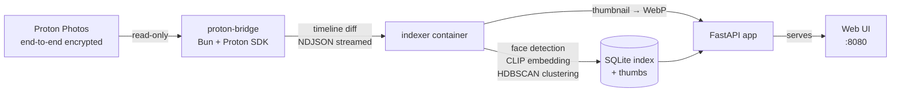

---
hide:
  - navigation
  - toc
---

# Documentation

Install, operate and extend Proton Faces: private face, object, place and free-text search over your Proton Photos, running on your own hardware. New here? Start with the [product tour](https://mmornati.github.io/proton-faces/) or the [80-second film](https://mmornati.github.io/proton-faces/video/).

### [Quickstart](getting-started/quickstart.md)
From session file to your first real search in about ten minutes.

### [Installation](getting-started/installation.md)
Docker Compose, the single-process layout, local development.

### [Demo mode](getting-started/demo-mode.md)
Run the whole app on a bundled photo library, no Proton account needed.

### [User guide](user-guide/index.md)
Every view, feature and shortcut: photos, search, people, places, albums.

### [Mobile & PWA](user-guide/mobile.md)
Install on your phone, offline app shell, the phone-first layout.

### [Architecture](reference/architecture.md)
Three containers, one SQLite index, zero telemetry.

### [Configuration](reference/configuration.md)
Every environment variable, with its safe default.

### [REST API](reference/api.md)
Every endpoint and the auth each one requires.

### [Security & privacy](reference/security-privacy.md)
What is on disk, what is not, how tokens and signed URLs work.

### [FAQ](reference/faq.md)
Common questions, straight answers.

### [Troubleshooting](reference/troubleshooting.md)
When the indexer stalls, the bridge refuses, or faces do not cluster.

### [Changelog](changelog.md)
What changed, release by release.

## How it works

```mermaid
flowchart LR
    A[Proton Photos<br/>end-to-end encrypted] -->|read-only| B[proton-bridge<br/>Bun + Proton SDK]
    B -->|timeline diff<br/>NDJSON streamed| C[indexer container]
    C -->|thumbnail → WebP| D[FastAPI app]
    C -->|face detection<br/>CLIP embedding<br/>HDBSCAN clustering| E[(SQLite index<br/>+ thumbs)]
    D -->|serves| F[Web UI<br/>:8080]
    E --> D
```

- **proton-bridge** authenticates with your existing Proton session and is the **only** component that ever talks to Proton. Strictly read-only: no uploads, no writes, no deletions.
- **indexer** runs recognition (faces + CLIP), generates thumbnails, clusters people and reverse-geocodes GPS, all in the background.
- **app** serves the FastAPI search API and the vanilla-JS web UI on `:8080`.
- Every photo is processed **once**: thumbnail downloaded (or decoded locally for HEIC), recognition run, a 512 px thumbnail cached, original bytes discarded.

## Try it without a Proton account

The hosted demo runs on a curated library of free CC0 and Unsplash photos: **[protonface.mornati.ovh](https://protonface.mornati.ovh)**, username `demo`, password `protonface-demo-2026-Q9vK3m`.

Or run the same fixture locally with `docker compose --profile demo up -d` and sign in at `http://localhost:8080` with `demo` / `proton-faces`. See the [demo mode guide](getting-started/demo-mode.md).

This project is not affiliated with Proton AG. "Proton", "Proton Drive" and "Proton Photos" are trademarks of their respective owners. Use at your own risk.

