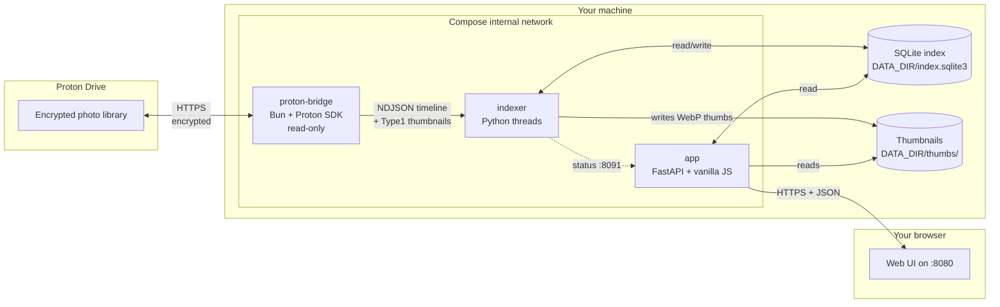
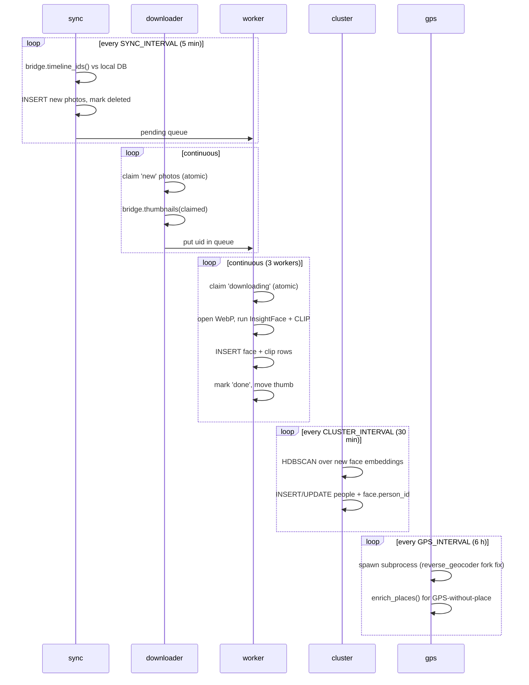
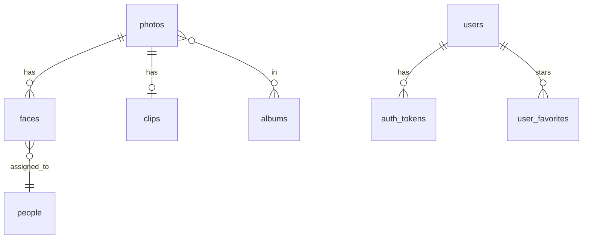

# Architecture

Proton Faces is intentionally small: a Proton bridge, an indexer, and a FastAPI app, all glued together with a shared SQLite index. This page is the deep dive.

## The 30-second version



Three observations:

1. **The bridge is the only thing that talks to Proton.** It authenticates with your session, decrypts the timeline, fetches thumbnails — and that's it. It never uploads, edits, or deletes a single byte.
2. **The indexer and app share one SQLite DB.** Per-row atomic claims (`UPDATE ... WHERE status='new'`) plus WAL mode + 30s busy_timeout mean the two processes interleave cleanly without any extra coordination.
3. **The web UI is a vanilla-JS single-page app** served as a static file. The backend is just a REST API over a SQLite file.

## Why three containers?

Originally proton-faces was a single FastAPI process that ran the recognition pipeline in background threads. That worked, but face detection could preempt the API event loop — every `/api/photos` request during a recognition burst would stall.

The split (issue #4) puts recognition on dedicated CPU cores:

| Container | Role | Owns |
|---|---|---|
| `proton-bridge` | The only component that talks to Proton | Nothing on disk; fetches thumbnails into `DATA_DIR/work/` |
| `indexer` | Recognition pipeline + clustering + GPS | The authoritative writers of `photos`, `faces`, `clips`, `people` |
| `app` | FastAPI search API + static web UI | Read-only against the index (except `user_favorites`/`tags`/favorites/archived/hidden metadata) |

The `app` container's status footer proxies the indexer's `/status` endpoint over the compose network (port 8091, internal-only — no host port mapping).

The single-process layout is still available: set `RUN_INDEXER=1` on the `app` container and the indexer threads start in-process. Useful for debugging or low-resource boxes.

## Cross-process safety

The SQLite index lives at `DATA_DIR/index.sqlite3` (default `/data/index.sqlite3` inside both containers, mounted from the `data` named volume on the host).

Writes are guarded by atomic claims:

```sql
UPDATE photos SET status='downloading' WHERE uid=? AND status='new'
UPDATE photos SET status='processing' WHERE uid=? AND status='downloading'
```

Each statement is wrapped in a `BEGIN IMMEDIATE` transaction (`_lock = threading.Lock()` in the store layer). WAL mode + a 30s busy_timeout means the app can read while the indexer writes without ever blocking.

The two containers don't share an event loop, a Python interpreter, or any in-memory state. They coordinate purely through the DB.

## Pipeline in detail



### Sync

`sync_once()` is cheap: it fetches only `{uid, captureTime}` from the bridge (no per-photo metadata decryption), diffs against the local DB, marks gone photos as `deleted`, and queues metadata fetches only for uids it hasn't seen before.

### Downloader

The Proton API batches at most 30 thumbnail IDs per request. The downloader claims `thumbnails_batch` photos at a time, asks the bridge to fetch them, and pushes the resulting uids into the in-memory `_pending` queue.

Photos whose server-side preview is missing (`no image preview`) are routed to the fullres loop — this is the HEIC / video path.

### Worker

Each worker thread claims one uid from `_pending`, runs face detection + CLIP on the cached thumbnail, writes results to the `faces` + `clips` tables, moves the thumbnail from `work/` to the final cache, and marks the photo `done`.

The full thumbnail bytes are discarded after processing — only the 512px WebP stays on disk.

### Fullres loop

For HEIC / videos that Proton doesn't preview:

- **HEIC / HEIF:** download full-res once, decode with `pillow-heif`, downscale to 512px WebP, run face detection + CLIP, discard full-res.
- **Video:** download once, extract a poster frame at ~10% of the duration via ffmpeg, re-encode as WebP, probe the duration via ffprobe, mark `done` immediately (skip CLIP/faces).

### Cluster

Every `CLUSTER_INTERVAL` seconds, HDBSCAN runs over all face embeddings whose `person_id IS NULL`. Clusters with at least `MIN_CLUSTER_SIZE` faces become `people` rows; smaller groups stay as singletons for the Unassigned queue.

### GPS

Every `GPS_INTERVAL` seconds, a child process is spawned (`python main.py --backfill-gps`). The subprocess:

1. Walks Google Takeout sidecars (`*.supplemental-metadata.json`).
2. sha1-hashes the local photos and joins against the indexed timeline by content hash (no full-res download needed).
3. Reverse-geocodes every photo that has GPS but no place yet.

It runs in a subprocess because `reverse_geocoder` forks a multiprocessing pool on first use, which deadlocks when called from a thread inside the long-lived app process.

## Data model



| Table | Purpose |
|---|---|
| `photos` | The local view of the timeline. Fields: uid, name, media_type, capture_time, sha1, albums (JSON), size_bytes, duration_sec, favorited (legacy), archived, hidden, tags (JSON), status, thumb_path, gps_lat, gps_lng, place, processed_at, error |
| `people` | A cluster of faces. Fields: id, name, cover_uid, cover_face_id, created |
| `faces` | One row per detected face. Fields: id, photo_uid, person_id, confidence, bbox (JSON), embedding (BLOB 512×float32) |
| `clips` | One row per photo. Fields: photo_uid (PK), embedding (BLOB 512×float32) |
| `albums` | Proton album cache. Fields: uid, name, cover_uid, photo_count, start_ts, end_ts, synced_at |
| `users` | Local family accounts. Fields: id, username, display_name, password_hash (bcrypt), role (read/write/admin), created_at, last_login_at, disabled |
| `auth_tokens` | Bearer tokens. Fields: token (PK, hex), user_id, kind (access/refresh), expires_at, created_at, user_agent, ip |
| `user_favorites` | Per-user star junction table. (user_id, photo_uid, created_at) |

Partial indexes:

- `idx_photos_done_time` — `capture_time DESC WHERE status='done' AND thumb_path IS NOT NULL AND thumb_path != ''` — keeps `/api/photos` cold latency at single-digit ms even on 100k libraries.

## Demo mode

In demo mode the bridge container is skipped. `bridge_client.get_bridge()` returns a `DemoBridge` that serves a curated fixture of 82 CC0 photos (32 face portraits + 50 picsum scenes). The ML pipeline — InsightFace, CLIP, HDBSCAN — runs identically. See the [demo-mode guide](../getting-started/demo-mode.md) for details.

## What's not in the architecture (yet)

- **Multi-bridge support.** One proton-bridge per stack.
- **Push notifications.** Sync is purely poll-based.
- **GPU acceleration.** ONNX Runtime + InsightFace run on CPU. CUDA providers are wired in `faces.py` but disabled.
- **Sync conflict resolution.** Local edits (tags, favorites, archived, hidden) are never written back to Proton — they're a parallel layer on top.

---

**Next:** [Configuration](configuration.md) lists every env var you can tune.
