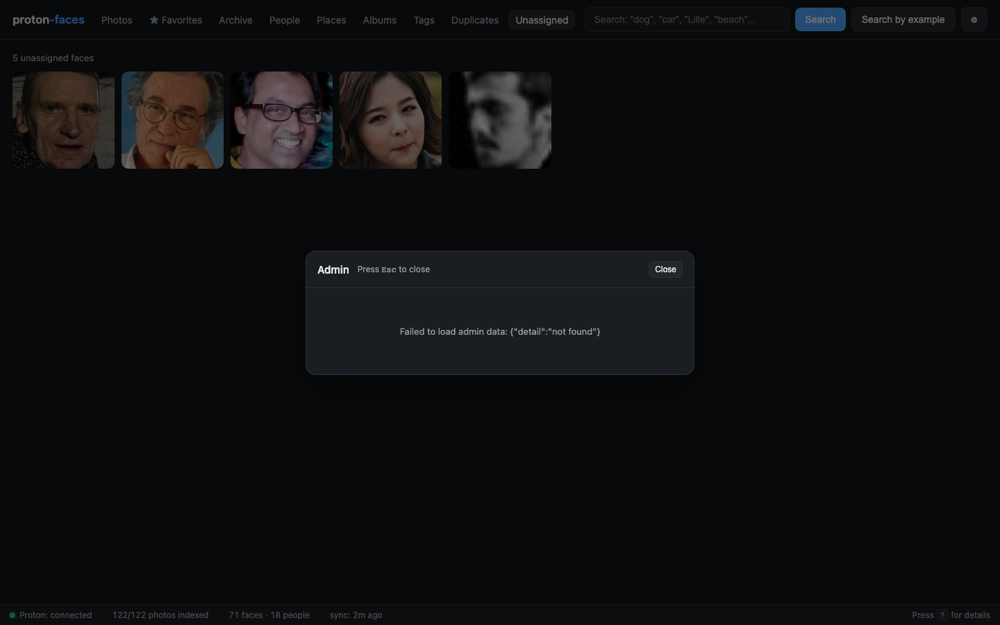

# Admin area

Admins get a **⚙ gear** button in the top-right of the header. Click it to open a modal with five tabs: **Overview**, **Health checks**, **Backups**, **Schedule**, and **Users**.

The gear icon only appears if you're logged in as a user with the `admin` role.

{ loading=lazy }

## Overview

- **Server** — hostname, Python version, uptime.
- **Disk** — disk usage of the data volume (thumbnails dir + SQLite file).
- **Last backup** — timestamp and size of the most recent snapshot.

## Health checks

Seven checks, run on demand, each with an ok/bad pill and a short status:

1. **DB integrity** — SQLite `PRAGMA integrity_check`.
2. **Free disk space** — `shutil.disk_usage` on `DATA_DIR`.
3. **Backup freshness** — last backup is within the configured retention window.
4. **Backup dir writable** — `_backups/` is creatable + writeable.
5. **Data dir writable** — `DATA_DIR` is creatable + writeable.
6. **Indexer liveness** — the indexer's status endpoint (`INDEXER_STATUS_PORT`) responds within 2 s.
7. **Proton bridge reachability** — `/api/health` reports the bridge is online + logged in.

{ loading=lazy }

## Backups

Every SQLite snapshot lives under `DATA_DIR/_backups/` as `index-<UTC-stamp>.sqlite3`. Snapshots are created with `VACUUM INTO` so they're consistent against the live WAL DB and non-blocking.

{ loading=lazy }

| Action | UI | API |
|---|---|---|
| List snapshots | See the table | `GET /api/admin/backups` |
| Create one now | Click **Backup now** | `POST /api/admin/backup` |
| Delete a snapshot | Click **Delete** on a row (with confirm) | `DELETE /api/admin/backups/{name}` |
| Prune | Click **Prune** | `POST /api/admin/backups/prune {"keep":N}` |

<div class="pf-video">
  <video src="../assets/screencasts/admin-backup.mp4" controls preload="metadata"></video>
</div>

<p class="pf-shot-caption">Open admin gear → Backups tab → click Backup now → watch the new snapshot appear.</p>

Path traversal is rejected: only `^index-\d+\.sqlite3$` is accepted as a snapshot name.

## Schedule

A daily auto-backup runs inside the `app` container. Configurable:

- **Enabled** — on/off.
- **Hour** — 0–23 UTC.
- **Minute** — 0–59.
- **Keep** — 1–365 (oldest pruned after every successful backup).

Stored at `DATA_DIR/admin_config.json`. The daemon thread wakes every minute and runs at most one backup per UTC day, so a missed backup doesn't pile up.

### API

| Endpoint | Purpose |
|----------|---------|
| `GET /api/admin/schedule` | Read the schedule |
| `PUT /api/admin/schedule` | Update the schedule |

## Users

List every account, create new ones, edit display name / role / disabled / password.

{ loading=lazy }

| Action | UI | API |
|---|---|---|
| List users | See the table | `GET /api/admin/users` |
| Create | Fill the form | `POST /api/admin/users` |
| Edit | Click **Edit** on a row | `PATCH /api/admin/users/{id}` |
| Reset password | Same dialog | (body `{"password":"…"}`) |
| Sign out everywhere | Click **Logout** on a row | `POST /api/admin/users/{id}/logout` |
| Delete | Click **Delete** (with confirm) | `DELETE /api/admin/users/{id}` |

### Constraints

- **Username ≥ 2 chars**, **password ≥ 8 chars** (validated on create + edit).
- **Cannot delete the last admin** — the server refuses so nobody can lock themselves out.
- **Role** must be one of `read`, `write`, `admin`. The role hierarchy is `read ⊂ write ⊂ admin`.
- **Disabled** users keep their tokens but get a `403 user disabled` on every request.
- **Display name** is purely cosmetic; defaults to the username.

### Bulk sign-out

`POST /api/admin/users/{id}/logout` revokes **every** bearer token for that user. Useful when a device is lost.

## Adding users outside the UI

Same data, same endpoints. From the host:

```bash
# Interactive (asks for password on stdin)
scripts/create-admin.sh mom

# Non-interactive (read password from env)
ADMIN_PASSWORD=mysecret scripts/create-admin.sh mom

# Inline with display name
scripts/create-admin.sh kid --display-name "Kid"
```

The first admin can also be created with `docker compose exec app python main.py --create-admin <username>`.

## Resetting a forgotten password

```bash
docker compose exec app python main.py --reset-password mom
```

You'll be prompted for a new password on stdin (or set `ADMIN_PASSWORD=...` first). All that user's existing tokens are revoked automatically.

---

**Next:** [Status & diagnostics](status.md) covers the bottom status bar and the `?` overlay.
