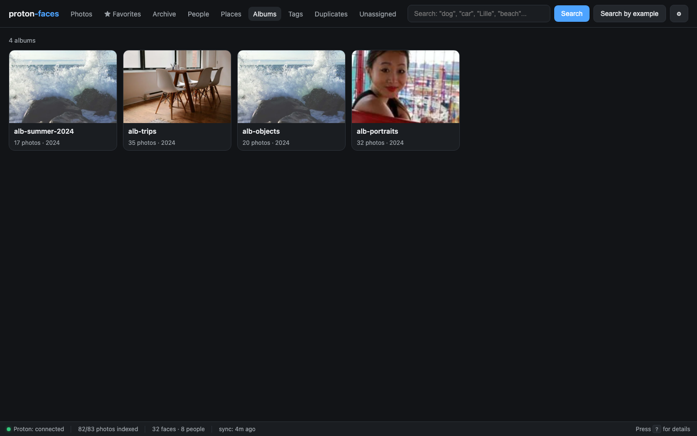
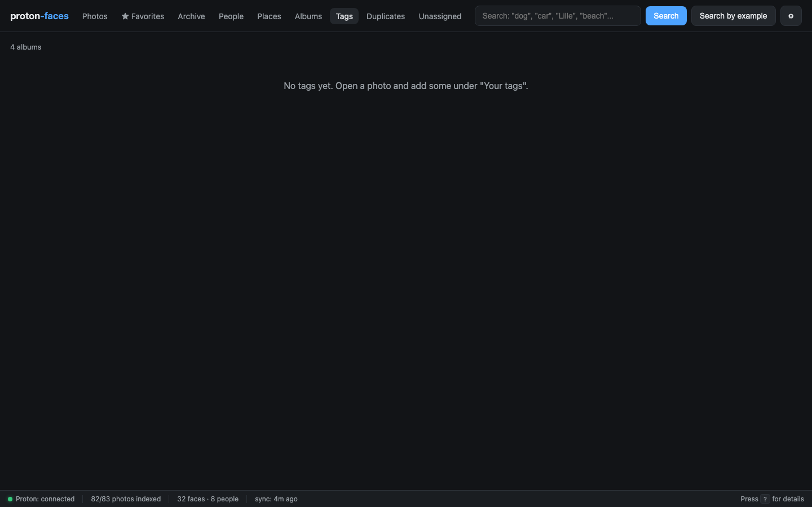

# Albums & tags

Proton Faces exposes two grouping mechanisms: **Proton albums** (read-only — they're whatever you put them in on Proton) and **free-form tags** (you set them in proton-faces).

## Albums (Proton-managed)

The **Albums** tab shows every album your Proton account has. Each album has a cover (the newest photo) and a photo count.

{ loading=lazy }

- **Click an album** → the photos grid filters to that album.
- **Album cover** — the newest photo in the album is used; you can override it by starring a different photo and… well, currently you can't. Cover selection is driven by `start_ts`/`end_ts` (albums are sorted by their earliest capture time).
- **Read-only.** Proton doesn't expose album-mutation endpoints, so you create and edit albums on Proton directly. The bridge syncs the album list every `SYNC_INTERVAL` (5 min default).

### API

| Endpoint | Purpose |
|----------|---------|
| `GET /api/albums` | List every album with cover + count |
| `GET /api/albums/{album_uid}/photos` | Photos in an album |

## Tags (your own labels)

Tags are **lowercase free-form strings** you attach to individual photos. Use them for cross-cutting concerns that don't fit albums: `birthday`, `favorite-recipe`, `tax-receipt`, `kiddo-first-day`.

### Where to set them

Open a photo's detail panel → scroll to the metadata table → there's a **Tags** row. Type a tag and press <kbd>Enter</kbd>. Click the × on a tag chip to remove it.

### Where to browse them

The **Tags** tab lists every tag in your library with a photo count. Click a tag → filter the grid.

{ loading=lazy }

### How they work under the hood

- Tags are stored as a JSON array in `photos.tags` (TEXT column).
- `SET` semantics: `PUT /api/photos/{uid}/tags` replaces the tag list; you can also `PATCH` individual tags.
- Tags are **per-user** (well — per-photo, shared across users). There's no per-user tag table yet; all users see all tags.
- The free-text **search box doesn't search tags.** Use the Tags tab instead.

### API

| Endpoint | Purpose |
|----------|---------|
| `GET /api/tags` | All tags with counts |
| `GET /api/photos/{uid}/tags` | Tags on one photo |
| `PUT /api/photos/{uid}/tags` | Replace the tag list (`{"tags":["foo","bar"]}`) |

## Albums vs tags — when to use which

| | Albums | Tags |
|---|---|---|
| Source of truth | Proton | proton-faces |
| Edits from the app? | No (read-only) | Yes |
| Cross-cutting | One per photo | Many per photo |
| Best for | Events, trips, "things I want to remember" | Labels, status, project-specific |

You can have a photo in multiple albums (Proton supports that) and tag it with as many tags as you like.

---

**Next:** [Favorites & archive](favorites-archive.md) covers starring, archiving, and the duplicates view.
