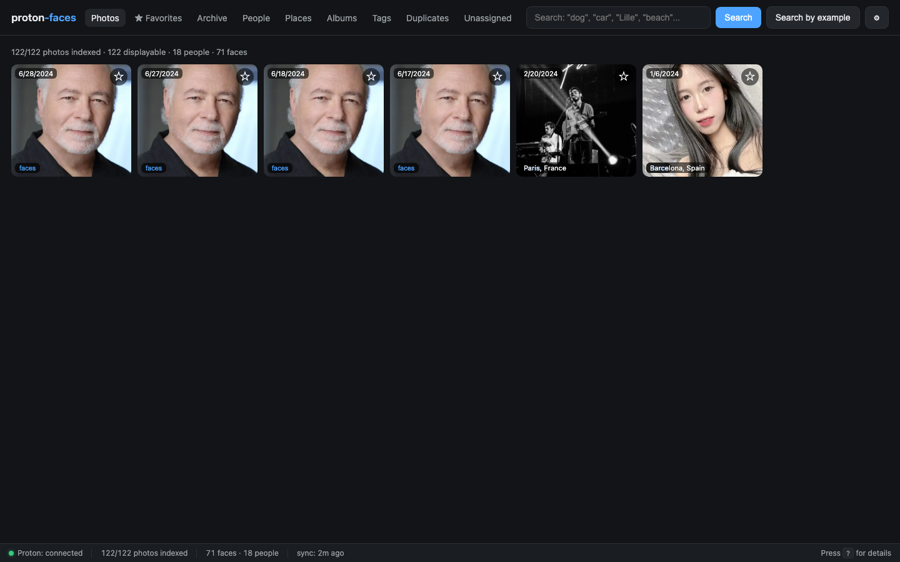

# Face tagging

Face tagging is the workflow of naming a face inside a photo and letting the system auto-tag every look-alike across your library. It's the fastest way to label thousands of photos.

## What you see on a photo

Open any photo that has detected faces. The detail panel highlights each face with a clickable blue box.

{ loading=lazy }

- The face box is positioned from the normalized bbox written at detection time.
- Hover over a face → the box highlights.
- Click a face → a popover appears with:
  - **Top matches**: the 5 existing people whose face is most similar to this one (with match %), for one-click assignment
  - A search box with **typeahead** over existing people
  - A **＋ New** button to create a fresh named person on the spot
  - **Unassign** (only meaningful for already-tagged faces)
- If the face is already assigned, the box shows the person's name as a label.

## Naming a face

There are three ways to name a face in the popover:

1. **Click a top match** — assigns the face to that person immediately.
2. **Pick from the typeahead** — start typing; matching people appear below the box, select one to assign.
3. **Create a new person** — type a brand-new name and press **Enter** or click **＋ New**. If a person with that exact name already exists, the face is merged into them instead.

Either way, three things happen:

1. The face is assigned to a cluster with that name. If a cluster with that name already exists, the face is **merged into it**. Otherwise a new cluster is created.
2. The cluster's cover face is updated to the highest-confidence face in the cluster.
3. **Every unassigned face whose embedding is more similar than `FACE_SIM_THRESHOLD` (default 0.45) is also tagged** with the same person. This is propagation.

The result: you name 3–4 photos of someone, and the rest of the library is auto-tagged.

<div class="pf-banner" markdown>
**Try it on the demo:** open any photo with a "faces" pill, click one of the faces, name it `Alice`, and watch — most other photos of the same person get tagged automatically within a second.
</div>

## Propagation in detail

Propagation is computed inside the same API call as the rename. The system:

1. Loads the assigned face's 512-d ArcFace embedding.
2. Queries `similar_faces(embedding, threshold, limit=500)` — a SQLite-side cosine-similarity scan over the `faces` table (no per-row network round trip).
3. For every returned face where `person_id IS NULL` (i.e. unassigned), it sets `person_id` to the new cluster.
4. Returns the number of auto-tagged faces alongside the response.

You can adjust the threshold in `.env`:

```bash
FACE_SIM_THRESHOLD=0.45
# Lower = more aggressive (catches more look-alikes, more false positives)
# Higher = stricter (only very similar faces get tagged)
```

## Demo: name a face

<div class="pf-video">
  <video src="../assets/screencasts/name-a-face.mp4" controls preload="metadata"></video>
</div>

<p class="pf-shot-caption">Open People → click a cluster → click a photo → click a face box → type a name.</p>

## Assigning an existing face to a different person

In the photo detail panel, click an already-named face → the popover lets you:

- **Rename** to a new name (auto-merges).
- **Assign to** an existing person (pick from a search dropdown).
- **Unassign** (back to "Unknown person").

## The merge picker

When you rename or assign, the modal that appears lets you search your existing people and merge into them. Useful for cleaning up duplicates that slipped past clustering.

{ loading=lazy }

## Edge cases

- **Multiple faces of the same person in one photo.** Each gets its own face box; tagging one doesn't auto-tag the others (they have separate embeddings, possibly from different angles). Use the photo detail to tag them all.
- **Tiny / partial faces.** RetinaFace has a minimum face size; very small or extreme-angle faces are skipped at detection time. They won't appear as boxes.
- **Children whose faces change.** Face embeddings drift as kids grow. You'll need to re-cluster occasionally; the indexer runs clustering every 30 minutes.
- **You in sunglasses vs. you without.** Usually clusters fine. With extreme occlusion (sunglasses + winter hat) the embedding drifts and the cluster might split.

## API endpoints

| Endpoint | Purpose |
|----------|---------|
| `GET /api/photos/{uid}/faces` | All face rows for a photo (bbox, person_id, person_name) |
| `GET /api/faces/{id}/crop` | The face-crop JPEG |
| `GET /api/faces/{id}/suggest` | Ranked "who might this be" people (top matches in the popover) |
| `POST /api/faces/{id}/person` | Assign (body: `{"name":"Alice"}` or `{"person_id":7}`) |
| `POST /api/faces/{id}/unassign` | Unassign |
| `POST /api/people/{id}/name` | Rename a cluster |

---

**Next:** [Places](places.md) covers the world map and the per-place workflow.
