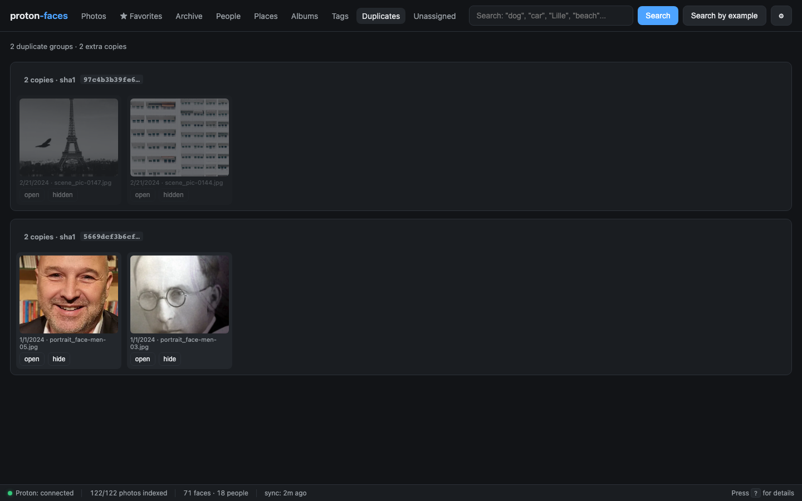

# Favorites & archive

Three lightweight flags per photo let you organize your library without leaving the grid: **★ favorite** (per-user), **▦ archived** (shared), and **hidden** (shared, used by the duplicates view).

{ loading=lazy }

## ★ Favorites (per-user)

- **★ Favorite button** in the top-right of every photo card, or in the detail panel.
- **Per-user.** Every family member has their own `user_favorites` table — your stars don't show up in your kid's view.
- The **★ Favorites** tab in the top nav is the photos grid filtered to your stars.

## ▦ Archive (shared)

- Click **▦ Archive** in the detail panel, or use the per-card archive button.
- Archived photos are hidden from the main **Photos** tab and the **search** results.
- They show up in the **Archive** tab and can be restored from there.

{ loading=lazy }

This is shared across users — the family shares one archive view.

## Hidden (duplicates)

- The Duplicates view uses the `hidden` flag to mark a copy as resolved.
- Hidden photos are hidden from every grid by default. Use `?include_archived=true` if you want to see them.

## Duplicates view

The **Duplicates** tab groups photos that share a Proton content-hash (sha1). These are photos Proton has confirmed to be byte-identical — usually the result of an import or a re-upload.

{ loading=lazy }

- Each group renders side-by-side. Click any photo to open the detail panel.
- Use the **Hide** button on a copy you don't want to keep. The remaining copy stays visible.
- Hidden copies don't reappear in the main grid unless you explicitly include archived/hidden.

### Demo: hide a duplicate

  <video src="../assets/screencasts/duplicate-hide.mp4" controls preload="metadata"></video>

Open Duplicates → pick a group → click Hide on the copy you don't want.

## API endpoints

| Endpoint | Purpose |
|----------|---------|
| `PATCH /api/photos/{uid}` | Toggle favorited / archived / hidden |
| `GET /api/photos/archived` | Every archived photo |
| `GET /api/photos?only_favorites=true` | Your favorites |
| `GET /api/duplicates?limit=200` | Duplicate groups (by sha1) |

## Per-user favorites — internals

`user_favorites` is a junction table `(user_id, photo_uid, created_at)` with `ON DELETE CASCADE` on both sides. Adding/removing a favorite is a single insert/delete.

When the grid lists a page of photos, the API does **one** batched `SELECT photo_uid FROM user_favorites WHERE user_id=? AND photo_uid IN (...)` to compute `favorited_by_me` for the whole page — no per-row network round-trip.

The legacy `photos.favorited` column is preserved for backward compatibility and is backfilled into the first admin's `user_favorites` on first `--create-admin` run.

---

**Next:** [Admin area](admin.md) covers the gear-icon modal — server info, health checks, backups, schedule, users.
