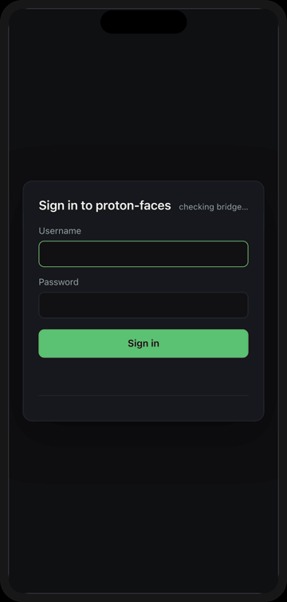

# Mobile & PWA

proton·faces is a **progressive web app**. The same single-page app you use in a desktop browser installs to your phone's home screen, launches full-screen with no browser chrome, and keeps working when the network drops. There is no separate mobile app to build, ship, or update — the PWA is served by your own instance.

{ loading=lazy }

## Install on your phone

The install flow is the standard one for each platform. You only need to do it once per device; the app updates itself afterwards.

=== "iOS / iPadOS (Safari)"

    1. Open your instance in Safari (e.g. `https://faces.example.com`).
    2. Tap **Share** → **Add to Home Screen**.
    3. Name it (defaults to `proton·faces`) and tap **Add**.

    The icon appears on your home screen and launches the app in **standalone** mode — no address bar, no Safari chrome.

=== "Android (Chrome)"

    1. Open your instance in Chrome.
    2. Tap the ⋮ menu → **Add to Home screen** (or **Install app**).
    3. Confirm the install prompt.

    Android also shows an **install banner** the first time you visit, because the manifest declares `display: standalone`.

=== "Desktop (Chrome / Edge)"

    1. Open your instance in Chrome or Edge.
    2. Click the **install icon** in the address bar (or ⋮ → **Install proton·faces**).
    3. The app opens in its own window, with its own taskbar entry.

## What you get

- **Standalone launch** — the app opens in its own window with the `proton·faces` name and icon, no browser UI.
- **Offline app shell** — the login screen and app frame are cached by the service worker (`pf-shell-v1`), so the app *opens* even with no connectivity. Your photos and search results are never cached — every `/api/*` and `/thumb` `/full` `/cover` `/crop` request goes straight to the network, so your private data is never stored on the device beyond what the browser already holds in memory.
- **Dark & light themes** — the app follows your system `prefers-color-scheme`; the installed PWA's splash screen and status bar match (`#101114` dark, `#f4f5f7` light).
- **Safe-area aware** — the bottom navigation respects the iPhone home indicator and Android gesture bar via `env(safe-area-inset-bottom)`.

## The mobile layout

Below 940px the app switches to a phone-first shell:

- **Bottom navigation** — Photos · Favorites · Archive · People · Places · Albums · Tags sit in a fixed bottom bar, thumb-reachable. Duplicates and Unassigned are hidden on phones (they're admin/cleanup tools; use a desktop browser for those).
- **Search bar** — moves to its own row under the header, full width, with a larger tap target.
- **Photo grid** — three columns, edge-to-edge, with the date/place pills dropped from each tile (full metadata lives in the detail sheet).
- **Detail sheet** — opens as a full-screen sheet with a sticky header; the photo fills the top half, metadata scrolls below.
- **Face search** (`Search by example`) is hidden on phones — upload a face photo from a desktop browser.

## Tips

- **Add to Home Screen before you need it** — the offline shell only helps if the app is installed and has been opened once while online.
- **The status bar is hidden on phones** — bridge and indexer health are still visible in the **Status & diagnostics** overlay (`?` in the footer, or the gear icon for admins).
- **2FA works on mobile** — enroll from **Status & diagnostics → Security** and use your authenticator app; the 6-digit code field appears automatically at login.
- **Session persistence** — the refresh token lives in an HttpOnly cookie, so closing the app doesn't log you out. See [Security & privacy](../reference/security-privacy.md) for how tokens work.

## Under the hood

- `manifest.json` — name, icons (192/512, `any` + `maskable`), `display: standalone`, theme colors.
- `sw.js` — service worker `pf-shell-v1`. Caches only the static shell (`/`, manifest, icons); **never** intercepts `/api/*` or binary photo endpoints. Stale-while-revalidate for the shell so updates land on the next load.
- The PWA is served by your own instance — there is no third-party service involved, and no telemetry.