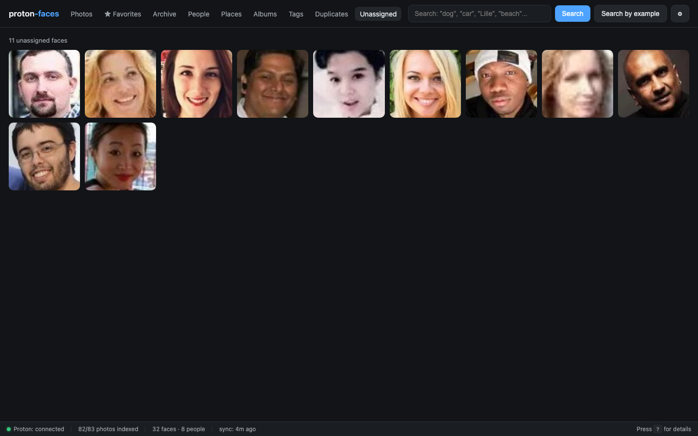

# People

The People tab is where you turn a pile of detected faces into a labelled library. Faces are auto-clustered into **person clusters** by ArcFace embedding similarity; you name the clusters; the system tags every look-alike.

{ loading=lazy }

## How clusters are built

1. **Face detection** — RetinaFace (InsightFace buffalo_l) finds every face in every indexed photo and writes a row in the `faces` table with the normalized bbox and a 512-d ArcFace embedding.
2. **Clustering** — every `CLUSTER_INTERVAL` seconds (30 min by default), HDBSCAN groups the embeddings. Any cluster with at least `MIN_CLUSTER_SIZE` faces becomes a `people` row.
3. **Naming** — you give a cluster a name in the UI. The name is just a label; the cluster's identity lives in its mean embedding, not the name.

The clustering is incremental: as new faces arrive, the indexer re-runs HDBSCAN and the cluster set is updated.

## The People grid

- **Face-crop covers** — each card shows the highest-confidence face crop from the cluster's "cover face" (`cover_face_id`). It's a JPEG crop from the cached 512px WebP, served from `/api/people/{id}/cover`.
- **Photo count + face count** — both numbers are computed in the same SQL query and updated whenever faces are added/removed/renamed.
- **Name input** — type a name and press <kbd>Enter</kbd>. The card updates immediately. If another person already has that name, the clusters are **merged** (the faces of one move to the other).
- **Merge into…** — pick a different person to merge into. Used when two clusters should be the same.
- **Map button** — opens the per-person map (see below).
- **Suggested merges** strip — pairs of clusters whose mean embeddings are highly similar (cosine ≥ 0.40). One click merges them.

## Naming and merging

| Action | UI | API |
|---|---|---|
| Name a cluster | Type in the card's name field | `POST /api/people/{id}/name {"name":"Alice"}` |
| Merge two clusters | Click **Merge into…** on the source card | `POST /api/people/{src}/merge {"target_id":X}` |
| Rename and merge | Name a cluster with an existing person's name | Same as naming — auto-merge |
| Unassign a face | In a photo detail, click the face box | `POST /api/faces/{id}/unassign` |

### Auto-tag propagation

Whenever you name a face — through the cluster card, through the photo detail, or by face-search — **every unassigned face whose embedding is more similar than `FACE_SIM_THRESHOLD` (default 0.45) gets the same label**.

This is what makes tagging manageable on a large library: name 3–4 photos of someone, and the rest are tagged automatically. You can adjust the threshold in `.env`:

```bash
FACE_SIM_THRESHOLD=0.45   # 0.40 = more aggressive, 0.50 = stricter
```

## Suggested merges

Above the grid is a "Suggested merges" strip that lists pairs of clusters whose mean face embeddings are highly similar (cosine ≥ 0.40). One click merges them. Useful for cleaning up "Unknown person #7" duplicates created by clustering across batches.

The list is computed with a vectorized `(N×D) @ (D×N)` matrix multiply, so it stays cheap even on thousands of clusters.

## Per-person map

Click **Map** on any card. A Leaflet map opens with one clustered marker per city where this person has been photographed. Click a marker to filter the photo grid to that place + person.

{ loading=lazy }

## The unassigned queue

Faces that didn't make it into any cluster (singletons, or noise from HDBSCAN) appear in the **Unassigned** tab:

{ loading=lazy }

Each face shows the photo thumbnail with a face-crop overlay. Click a face to open the photo detail panel where you can name it — propagation kicks in as usual.

## Suggested merges — internals

The matrix multiply `X @ X.T` computes every pairwise cosine similarity at once. For 100 clusters that's a 100×100 matrix = trivial. For 10 000 clusters it's still under 100 MB of float32 and a single GPU-free CPU pass. Cached for 30 seconds so repeated reloads are free.

## API endpoints

| Endpoint | Purpose |
|----------|---------|
| `GET /api/people?q=&limit=200` | List clusters, optionally filtered by name |
| `GET /api/people/{id}/cover` | Face-crop cover JPEG |
| `GET /api/people/{id}/photos` | Photos containing this person |
| `GET /api/people/{id}/map` | Clustered map markers for this person |
| `GET /api/people/duplicates?threshold=0.40` | Suggested merges |
| `POST /api/people/{id}/name` | Rename (auto-merges if name exists) |
| `POST /api/people/{src}/merge` | Explicit merge |
| `POST /api/faces/{id}/person` | Assign a face to a person / create new |
| `POST /api/faces/{id}/unassign` | Unassign a face from a person |
| `GET /api/faces/unassigned` | The unassigned queue |

---

**Next:** [Face tagging](face-tagging.md) covers the clickable-boxes-on-photos flow in detail.
