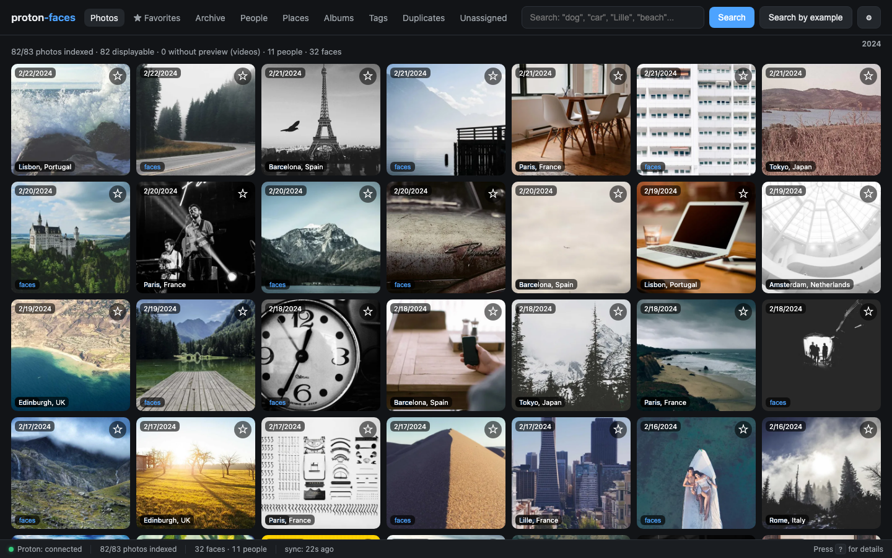
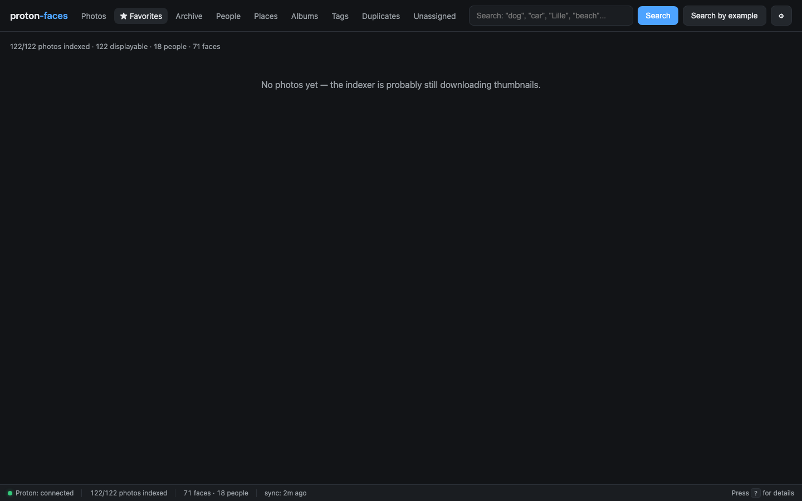

# Photos

The Photos tab is the default view — an infinite-scroll grid of every indexed photo, newest first. It also hosts the date rail, the "On this day" memory strip, and the full-resolution detail panel.

{ loading=lazy }

## What's on each card

- **Thumbnail** — 512px max-side WebP, served by `/api/photos/{uid}/thumb` with `immutable` cache headers.
- **Capture date** (top-left) — formatted in UTC; the date rail above the grid sorts photos by month.
- **Favorite button** (★, top-right) — per-user star; toggles `favorited_by_me`.
- **Place label** (bottom-left) — for GPS-tagged photos, the reverse-geocoded city.
- **"faces" pill** (blue, bottom-right) — only shown if the face detector found at least one face in this photo.
- **▶ video badge** (top-right) — videos get a play icon and the duration overlay; click opens the inline HTML5 player.
- **"On this day"** strip — at the top of the grid when there are photos from today's date in past years.

## Infinite scroll

The grid loads 200 photos at a time. Scrolling near the bottom triggers another fetch. The page-set stays in memory so back-navigation doesn't refetch.

## Filters and chips

| Chip / control | Behavior |
|---|---|
| Click a date in the date rail | Scroll to photos from that month |
| Click a chip in a "On this day" card | Open that photo |
| Click any photo card | Open the detail panel (full-res download on demand) |
| Click ★ | Toggle your favorite |
| Click ▦ (archive) | Move the photo to Archive; hide from the grid |
| Click the place label | Filter the grid to photos from that city |

## The detail panel

Click any card to open the detail panel (slides over from the right). It shows:

- The full-resolution photo (streamed from Proton on demand, never stored locally)
- For videos: the HTML5 player with HTTP Range seeking
- The metadata table: capture time, size, dimensions, Proton tags, GPS coordinates, place, people, albums
- The actions bar: ★, archive, **View full resolution** (downloads to your browser), Close

{ loading=lazy }

The full-res download is **read-only** against Proton — the bridge never uploads, edits, or deletes a single byte.

## Per-user favorites

A star only affects *your* view. Every user has their own `user_favorites` table; the legacy `photos.favorited` column is preserved for backward compatibility but never read.

The **★ Favorites** tab is just the photos grid filtered to your favorites:

{ loading=lazy }

## Archive

Click ▦ in the detail panel (or use the per-card archive button) to hide a photo from the grid without deleting it. Archived photos show up in the **Archive** tab and can be unarchived from there.

{ loading=lazy }

## "On this day"

Above the grid, an auto-scrolling strip shows photos you took on today's calendar date in previous years. Each card carries an "X years ago today" badge.

The data comes from the `memories_for_today()` SQLite query (`/api/memories`) and excludes photos taken in the current calendar year.

## Performance notes

- The main grid query (`done_photos`) uses a partial index `idx_photos_done_time` over `capture_time DESC WHERE status='done' AND thumb_path IS NOT NULL AND thumb_path != ''` — keeping `/api/photos` cold latency at single-digit ms even on 100k+ libraries.
- Thumbnails are served with `Cache-Control: public, max-age=31536000, immutable` — your browser caches them forever, so revisiting the grid is instant.
- The 512px WebP is ~30% smaller than JPEG at the same perceived quality.
- The `favorited_by_me` flag is computed in a single batched query for the whole page, not per-row.

## Videos

Videos appear with a play badge and a duration overlay (from `ffprobe`). The card click opens the inline HTML5 player with HTTP Range seeking — you can scrub without downloading the whole file. The full-res fetch is streamed via `bridge.full_photo(uid, range_header=...)`.

There is **no preview thumbnail** for videos (Proton doesn't expose one), so the indexer downloads the full-res video once, extracts a poster frame at ~10% of the duration, encodes it as WebP, and discards the full-res bytes. Only the poster stays on disk.

## API endpoints

| Endpoint | Purpose |
|----------|---------|
| `GET /api/photos?limit=200&offset=0` | Page of indexed photos |
| `GET /api/photos?place=Paris` | Photos from a specific place |
| `GET /api/photos?before=1716240000` | Photos captured before an epoch timestamp |
| `GET /api/photos?only_favorites=true` | Your favorites only |
| `GET /api/photos/{uid}` | Single photo row (full metadata) |
| `GET /api/photos/{uid}/thumb` | 512px WebP thumbnail |
| `GET /api/photos/{uid}/full` | Full-resolution stream (range-supported) |
| `PATCH /api/photos/{uid}` | Toggle favorited / archived / hidden (write role) |
| `GET /api/photos/{uid}/faces` | Faces detected in this photo |
| `GET /api/photos/{uid}/tags` | User tags |
| `PUT /api/photos/{uid}/tags` | Replace the tag list |
| `GET /api/memories` | "On this day" photos |

See the [REST API reference](../reference/api.md) for the full schema.

---

**Next:** [Search](search.md) covers free-text CLIP and the face-search-by-example flow.
