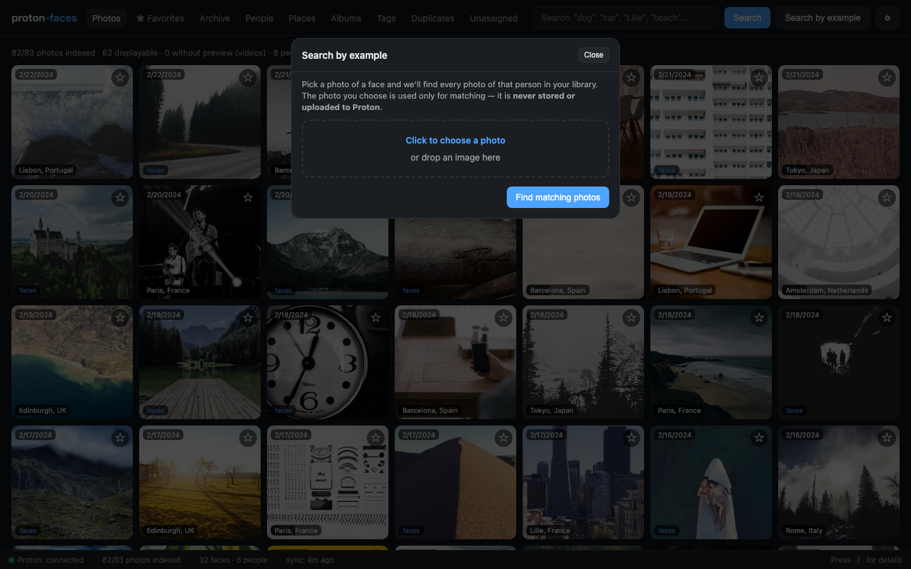

# Search

Proton Faces exposes two search modes: **free-text** (zero-shot CLIP) and **face search by example** (ArcFace). Both run entirely locally.

{ loading=lazy }

## Free-text search (CLIP)

Type anything into the search bar at the top of the page and press <kbd>Enter</kbd> (or click **Search**). The query is embedded by CLIP's text encoder into the same 512-d vector space as every indexed photo, then ranked by cosine similarity.

### What works

| Query type | Backed by | Notes |
|---|---|---|
| `"dog"`, `"cat"`, `"beach"`, `"sunset"` | CLIP text–image similarity | Zero-shot, no per-photo labels needed |
| `"Lille"`, `"Paris"`, `"Berlin"` | GPS reverse-geocoding | Returns photos with a matching place name |
| Person name (People tab → open) | HDBSCAN clusters + your labels | Per-person photo grid |
| Map marker on the Places tab | GPS aggregation | Clustered markers, click to filter |

The query text is matched by CLIP **and** GPS in parallel — results are merged and re-ranked.

### Demo: typing "dog", "beach", "Lille"

  <video src="../assets/screencasts/search-typing.mp4" controls preload="metadata"></video>

Type a word, the grid re-ranks in real time. No submit needed.

### Performance

The CLIP matrix (every photo's 512-d vector) is cached in process memory. It's rebuilt only when the clip row count changes or after the 60-second TTL — even on a 100k-photo library the rebuild is ~88 MB of numpy data, sub-second.

Each search request computes `X @ q` (a single matrix-vector multiply) and returns the top-k uids. Typical latency: a few ms.

## Face search by example

Click **Search by example** in the top bar. A modal opens with a dropzone.

{ loading=lazy }

Drop a photo (or click to choose one) containing a face. The face is detected with RetinaFace, embedded with ArcFace, and the closest matches in your library are returned, ranked by cosine similarity.

{ loading=lazy }

The uploaded photo is **never stored** and **never sent to Proton**. It is decoded in memory, embedded, then immediately discarded. The request only carries a 512-float32 embedding vector.

## How CLIP + face search differ

| | Free-text | Face search by example |
|---|---|---|
| Query | Text | Image (must contain a face) |
| Embedding model | CLIP ViT-B/32 (text encoder) | ArcFace (R50, 512-d) |
| Returns | Top-k similar photos | Top-k similar faces → photos containing them |
| Latency | ~5–20 ms | ~50–200 ms (face detection per request) |

## API endpoints

| Endpoint | Purpose |
|----------|---------|
| `GET /api/search?q=dog&limit=100` | Free-text semantic search |
| `POST /api/search/face` | Face search by example (multipart upload) |

Both require authentication.

## Tips

- **Compound queries work.** Type `"beach paris"` and CLIP blends both concepts.
- **CLIP's zero-shot vocabulary is enormous.** It can match *"renaissance painting"*, *"concert crowd"*, *"labrador"*, *"sunset over the ocean"* without ever having seen those labels in your library.
- **Place names win over text.** When you type `"Paris"`, the GPS path is preferred over CLIP — there are usually more photos with `place='Paris, France'` than photos that CLIP thinks look Parisian.
- **Face search needs a real face.** Group photos where the face is tiny don't work well. Crop or zoom in.

---

**Next:** [People](people.md) dives into clustering, naming, and the per-person map.
